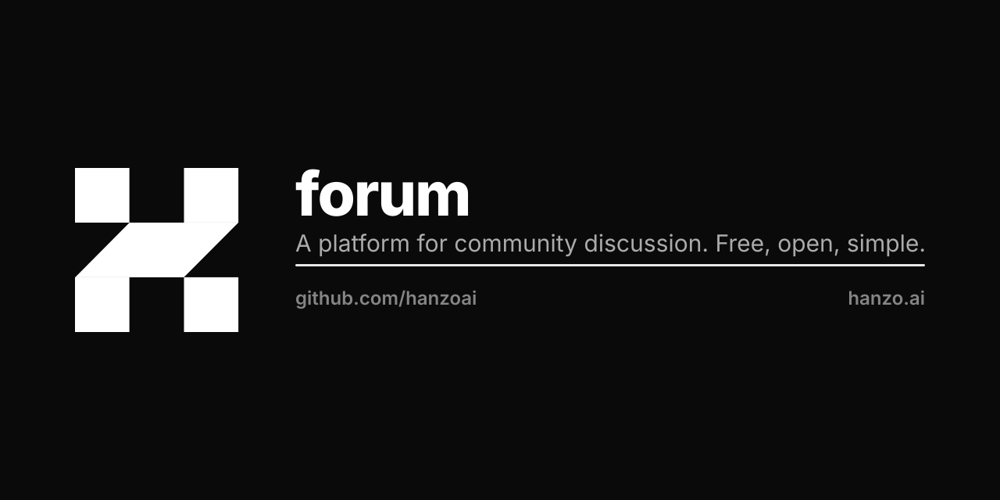

# hanzoai/forum

A tracking fork of [Discourse](https://github.com/discourse/discourse), kept for a future
Hanzo community forum.

## Status

Nothing Hanzo-specific has been built on top of it yet, and nothing is deployed. The
commits on this fork are CI, branding assets and agent docs; the application code is
upstream's. If you are looking for a running Hanzo forum, there isn't one — start at
[docs.hanzo.ai](https://docs.hanzo.ai/docs), or open an issue on the repository you have a
question about under [github.com/hanzoai](https://github.com/hanzoai).

If you want to run Discourse, or you have a Discourse question, go to
[discourse.org](https://www.discourse.org) and
[meta.discourse.org](https://meta.discourse.org). They maintain it; we only track it.

## Working on this fork

The upstream setup guides apply unchanged — Ruby 3.2+, PostgreSQL 13, Redis 7:

- [Docker / Dev Container](https://meta.discourse.org/t/336366)
- [macOS](https://meta.discourse.org/t/15772)
- [Ubuntu / Debian](https://meta.discourse.org/t/14727)
- [Windows](https://meta.discourse.org/t/75149)

Production install: [`docs/INSTALL.md`](docs/INSTALL.md).

Changes that belong upstream should go upstream — send them to
[discourse/discourse](https://github.com/discourse/discourse) rather than here, so this
fork stays easy to rebase.

## Lineage and license

Discourse, copyright 2014–2025 Civilized Discourse Construction Kit, Inc., licensed
GPL-2.0-or-later. This fork keeps that licence; see [LICENSE](LICENSE). The Discourse logo
and "Discourse Forum" are their trademarks, and this fork is not affiliated with or
endorsed by them.
